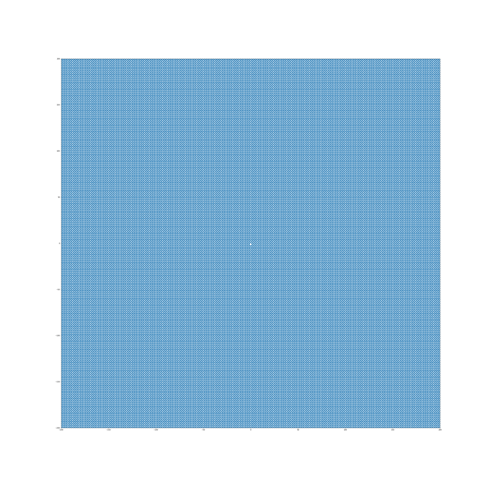

# Ulam Divisor Analysis

This is a small document that collects some findings done during hacking on the Ulam spiral. Although I spent two fun evenings hacking on this at the time of writing, I regret not being able to spend any time or energy on this and hope this document will lead to others taking this up together.

## Definitions

The Ulam spiral is drawn by spiraling out numbers from the inside towards the outside, typically in counter-clockwise fashion. There is not necessarily any official definition, but in my definition, I rotate it 90 degrees compared to the standard literature, to suit the ease of some formulae.

This makes the spiral look like this:


Note the right-bottom point of each spiral turn: <h3><b>1,9,25,49,...</b></h3>

This right-bottom point is given by the series 


This corner-point is one way to generate the spiral, and yields the following naive formula to convert spiral grid coordinates into spiral numbers. Note that it is perfectly possible to create more standard formulae but this construction is handy to illustrate some of the findings.

```python
def spiral_cell(x,y):
    m = max(abs(x),abs(y)) # square that point belongs to
    p = (2*m+1)*(2*m+1) # right-bottom point of square

    # return the point by retracing from the right-bottom point
    if x == m:
        # right side
        return p - (m + y)
    if y == m:
        # top side
        return p - 2*m - (m - x)
    if x == -m:
        # left side
        return p - 4*m - (m - y)
    if y == -m:
        # bottom side
        return p - 6*m - (m + x)
```

One of the main findings is the appearance of "lines" in the Ulam spiral when <b>prime numbers</b> are marked on it. Some research such as [https://www.researchgate.net/publication/307965102_Finding_Line_Segments_in_the_Ulam_Square_with_the_Hough_Transform] supports this quantitatively.
This analysis will partially demistify this, but will open up more questions.


## Main Findings

From rendering various Ulam spirals, it seems the factors of numbers (the factors of "2" being "2n", the factors of "7" being 7n), form <b>clusters</b> in the spiral that are repeated in the horizontal and vertical direction. The following table illustrates this, showing how the factors of numbers are aligned in the Ulam spiral.

<table>
  <tr>
    <th>
      Factors of ...
    </th>
    <th>
      Pattern
    </th>
  </tr>
  
  <tr>
    <td>
      <h3>2n</h3>
    </td>
    <td>
      
    </td>
  </tr>
  </table>

These clusters all seem to be able to be modeled by polynomials in n, that generate a specific cluster of numbers for certain n, and can then be offset in the horizontal or vertical direction by .


